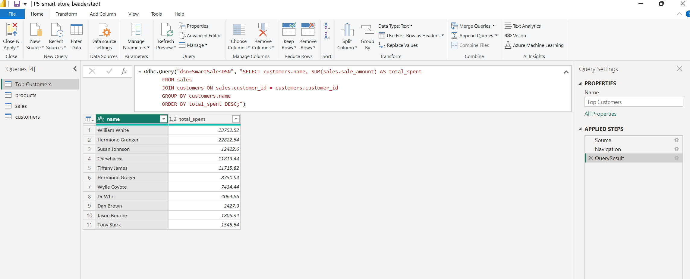

# smart-store-beaderstadt
# Project 5 - Cross-Platform Reporting with Power BI

## Overview

In Project 5, we will use Power BI Desktop to apply core BI techniques (slicing, dicing, and drilldown) and generate interactive visualizations to explore business performance. This project reinforces key data analysis and reporting skills used across industries.

---
## **How to Install and Run the Project**
---
### **Step 1. Create a New Repo in GitHub**
 - Open your browser and log in to your GitHub account.
 - Select 'Create New Repository' from the dropdown menu, and name your repo.
 - Select the Public option so others can view your repository, and add a README.md file.
 - Click the 'Create repository' button to finalize the process.
 - Clone your repo to local using your new URL pasted into the following example command.
  - git clone https://github.com/youraccount/yourrepo
 - Create your .gitignore and requirements.txt files.
 - Run the following command from your project route directory to create your virtual environment.
  - py -m venv .venv
 - Use the following commands to add files to version control.
IMPORTANT: Replace the commit message with a clear and descriptive note about what you added or changed.
  - git add .    # stages changes, adds files to source control
  - git commit -m "Add .gitignore and requirements.txt files"    # creates a labeled snapshot of staged changes.
  - git push -u origin main    # updates the remote repository
 - Open the newly cloned folder to begin working in it by selecting 'file' 'open folder' navigate to the new repo and select 'open'.
---
### **Step 2. Activate Your .venv**
 - Before making any changes to a project, ALWAYS pull the latest changes from the remote repository on GitHub using the following command.
  - git pull origin main
 - Run the following command to activate your .venv # HINT- You MUST activate your .venv before editing a project.
  - .venv\Scripts\activate
---
### **Step 3. Install Packages Into Your Local Project Virtual Environment**
 - Ensure your .venv is active, update key packages, and install dependencies from your requirements.txt using the following commands.
  - .venv\Scripts\activate
  - py -m pip install --upgrade pip setuptools wheel
  - py -m pip install -r requirements.txt
---
## **Repeatable Project Workflow**
 Follow these steps when starting a new work session on a professional Python project.
### **1. Pull the Latest Changes from GitHub:**
  - git pull origin main
### **2. Activate the Project Virtual Environment:**
  - .venv\Scripts\activate
### **3. Install Dependencies As Needed:**
  - py -m pip install -r requirements.txt
### **4. Run Scripts as needed:**
  - select python interpreter for your local venv
  - py myfile.py   
### **5. Run Jupyter Notebooks as needed:**
 - click the kernel selector in the top-right corner of the notebook editor and choose the interpreter associated with your .venv.
 - Click on a cell and press Shift+Enter to execute it and move to the next cell.
 - Alternatively, use Ctrl+Enter to execute the current cell without moving.
 - Use 'Run ALL' to execute notebooks fully before running git add-commit-push to GitHub.
 - Save your notebook periodically to avoid losing progress. Or make sure the File / Autosave option is on.
### **6. Save your work with git add-commit-push to GitHub:**
  - git add .    
  - git commit -m "Add your unique message here." 
  - git push -u origin main  

---

  # P1 Specifications
  Project 1 is a hands-on project, that follows professional practices for starting a business intelligence data analytics project. Our project will evolve over time, so we want a place to keep it safe - backed up and ready for sharing or presenting our work. For that, we'll use GitHub, a popular place for storing code.
  # Link to starter repo: https://github.com/denisecase/smart-sales-starter-files/
---
## Task 1: Plan Your Project
- Before you start coding, spend some time planning your project. 
- We will start with a common business insight: https://github.com/denisecase/smart-sales-analysis-goals/blob/main/example_bi_goals/1-CUSTOMER_TOTAL_REVENUE.md

## Task 2: Complete/Verify Initialization
- Follow the above step-by-step instructions to initialize a new Python project.
- Hint: you should have both a GitHub repo (which you created with a default README.md) and have cloned it down to your machine, added useful files, done a git add-commit-push to GitHub and created a project virtual environment for Python. 

## Task 3: Organize Your Project Folder
- Open the project in VS Code or use your computer's file management program to organize your project professionally. For now, just organize the project this way. Files will be mostly empty - we'll add contents later.

smart-store-yourname/   
│
├── data/                
│   ├── raw/                          
│
├── scripts/                            
│
├── utils/                     
│   └── logger.py              
│
├── .gitignore                 
├── README.md                  
└── requirements.txt     

- First, create the folders. Follow capitalization (all lower case), spelling, and spacing, EXACTLY. 
- In your project repository, create the data folder first as show above. In the data folder, create a folder named raw (if it doesn't exist yet). 

## Task 4: Add Sample Data
- Use the sample data files provided in this repository: https://github.com/denisecase/smart-sales-raw-dataLinks to an external site. to your data/raw folder.
- Either download these files and put them in your data/raw folder, or create new empty files and copy and paste the contents into each. 
- For best results, be sure the file names are exactly the same.
- When finished, in your data/raw folder, you should have with some raw sample data in each:

    - customers_data.csv
    - products_data.csv
    - sales_data.csv

## Task 5: Explore the Data
- Before using tools, examine the data manually. Open the CSV files and make a few observations:
---
  # P2 Specifications
  In Project 2 we continue to initialize a business intelligence data analytics project. Our goal is to get acquainted with these powerful tools and key files so we'll feel a bit more comfortable joining a Git-based team.

## Task 6: Add Utility & Script Files
- In VS Code, use File / New Folder to create a new folder named utils to hold your utility scripts.
- create a file named logger.py (exactly). Copy and paste the content from the starter repo linked above. 
- In VS Code, use File / New Folder to create a new folder named scripts to hold your scripts.
- create a file named data_prep.py (exactly).  Copy and paste the content from the starter repo linked above. 
---
   # P3 Specifications
   In Project 3, we'll focus on using raw data and cleaning methods. The data we'll be working with has already been partially cleaned in previous projects. The aim is to get the data into a clean, consistent format, laying the groundwork for the more complex analytics tasks ahead. This ensures that the insights we generate are built on accurate and trustworthy data.
 ## Task 7: Practice Reusable Cleaning with a DataScrubber Class
 - Create the following file in your project: scripts/data_scrubber.py 
 - Copy and paste the content from the module 3 repo (https://github.com/denisecase/smart-sales-docs/)
 - Complete the remaining TODO items in this script.
  
 ## Task 8: Test the DataScrubber Class
 - Create the following folder and file for this in your project:tests/test_data_scrubber.py
 - Copy and paste the content from the module 3 repo linked above.
 - Use the terminal to run the test_data_scrubber.py script.
 - py tests\test_data_scrubber.py
  
## Task 9: Use Your Data Scrubber
- Now that we've verified these methods, we can run the data_prep.py script that cleans and prepares the data.
- Use the terminal to run the data_prep.py script.
- py scripts\data_prep.py
- ---
   # P4 Specifications
   In Project 4, we design and implement a data warehouse  structure that optimizes data retrieval and scalability. 
   We will build the schema, load the cleaned data, and validate the structure. This prepares us for advanced business intelligence tasks and data-driven decision-making.
## Task 10:  Plan Your Data Warehouse
- Design Your Data Warehouse Schema
- Determine the most suitable schema for your data warehouse (Hint: We use Star Warehouse in this example)
- Sketch out the tables

## Task 11: Define, Create, and Populate Your DW Schema
- Create a 'scripts' subfolder named 'dw_scripts'
- Create a file inside named etl_to_dw.py (it can do all steps together).
- Create a file inside named create_tables.sql (for debugging I chose to build and test my SQL first and keep them separate, but either way works.)
- Contents of both files was copy and pasted from course website.
- Adjused this to reflect my tables, columns, and their appropriate data types. 

## Task 12:  Validate the Data Warehouse
- Use the terminal to run the etl_to_dw.py file.
- py scripts/dw_scripts/etl_to_dw.py
- Ensure the schema is correctly implemented and that the structure meets your design expectations. 
- - ---
   # P5 Specifications
   In Project 5, we will use Power BI Desktop to apply core BI techniques (slicing, dicing, and drilldown) and generate interactive visualizations to explore business performance. This project reinforces key data analysis and reporting skills used across industries.

   ### SQL Queries & Reports

- **Top Customers Query**: Used a JOIN between `sales` and `customers`, grouped by customer name, and summed total spent.
- **Sales by Product & Region**: Created a Matrix visual to dice data by category (Rows) and supplier (Columns), with the values representing the count of unit_price.
- **Sales Trends Drilldown**: Used hierarchy (Year > Quarter > Month) to explore sales over time using a column chart.

### Dashboard Design Choices

- Used **slicer** to filter by sale date, providing flexible time-based analysis.
- Added **bar chart** to display top customers by total spending.
- Created **matrix visualization** for clear cross-section of product category and region.
- Added **column chart** to explore sales over time using a hierarchy (Year > Quarter > Month).
- Used a **line chart** with drilldown to explore sales trends across time.
- Used **slicer** to focus on specific product categories across all visuals
- Added color-coded visuals to improve interactivity and clarity.

### Power BI Model View

### Query Results

### Final Dashboard

